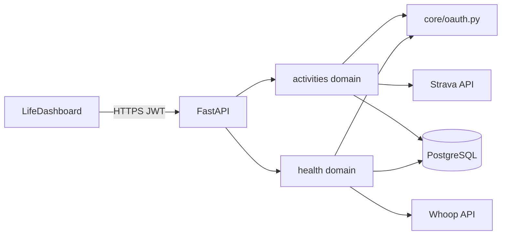

---
tags:
  - project
  - fitness
  - backend
  - integrations
  - strava
  - whoop
title: Strava & Whoop Integration — Implementation Record
created: 2026-05-20
status: implemented
---

# Strava & Whoop Integration — Implementation Record

> **Design spec:** [Plans/2026-05-20-fitness-strava-whoop-integration-design.md](Plans/2026-05-20-fitness-strava-whoop-integration-design.md)  
> **Client:** LifeDashboard (macOS) — running and health data via the FitnessTracker backend  
> **Shipped:** 2026-05-20

This document records what was built, where it lives, how to configure and verify it, and how it behaves at runtime. It complements the design draft and the updated system/backend design specs.

---

## 1. Summary

The backend now exposes JWT-protected Strava running-activity and Whoop health endpoints for LifeDashboard. Data syncs **on demand** when dashboard routes are called (no background workers or webhooks in V1).

| Area | Deliverable |
|------|-------------|
| **Phase 1a — Strava** | OAuth connect/disconnect, sync running activities, `/activities/recent` and `/activities/summary` |
| **Phase 1b — Whoop** | OAuth connect/disconnect, sync sleep/recovery/strain, `/health/today`, `/health/recent`, `/health/summary` |
| **Shared** | `app/core/oauth.py`, `oauth_tokens` table, token refresh with rotation, in-memory OAuth CSRF state |

---

## 2. Architecture



**Domain split (Approach A from design):**

- `app/domains/activities/` — Strava client, `OAuthToken` ORM model, activity sync and read APIs
- `app/domains/health/` — Whoop client, `DailyHealthRecord` ORM model (imports `OAuthToken` from activities)
- `app/core/oauth.py` — CSRF state store, token exchange/refresh, shared provider errors

Routers are registered in `app/main.py` with `settings.api_v1_prefix` (`/api/v1`).

---

## 3. Module layout

### Created

| Path | Role |
|------|------|
| `app/core/oauth.py` | OAuth state (5 min TTL), Strava/Whoop token exchange & refresh, `ProviderAuthExpiredError` |
| `app/domains/activities/models.py` | `OAuthToken`, `StravaActivity` |
| `app/domains/activities/schemas.py` | API request/response models, computed miles/pace |
| `app/domains/activities/repository.py` | Token and activity persistence |
| `app/domains/activities/service.py` | OAuth flows, `sync_if_stale`, summaries |
| `app/domains/activities/router.py` | `/activities/*`, `/auth/strava/*` |
| `app/domains/activities/strava_client.py` | Strava HTTP client |
| `app/domains/health/models.py` | `DailyHealthRecord` |
| `app/domains/health/schemas.py` | Health read models (sleep / recovery / strain groups) |
| `app/domains/health/repository.py` | Health record persistence |
| `app/domains/health/service.py` | OAuth flows, Whoop normalization, `sync_if_stale` |
| `app/domains/health/router.py` | `/health/*`, `/auth/whoop/*` |
| `app/domains/health/whoop_client.py` | Whoop HTTP client |
| `alembic/versions/phase2_05_integrations.py` | Migration for three new tables |

### Modified

| Path | Change |
|------|--------|
| `app/config.py` | Strava/Whoop credentials, redirect URIs, `sync_staleness_minutes`, `strava_configured()` / `whoop_configured()` |
| `app/main.py` | Register `activities` and `health` routers |
| `alembic/env.py` | Import activities and health models for metadata |
| `tests/conftest.py` | Truncate `oauth_tokens`, `strava_activities`, `daily_health_records` |
| `.env.example` | Document integration env vars |

### Tests

| Path | Coverage |
|------|----------|
| `tests/unit/test_oauth.py` | State TTL, refresh, rotation, credential errors |
| `tests/unit/test_activities_schemas.py` | Computed distance/pace fields |
| `tests/unit/test_strava_client.py` | Client parsing and errors |
| `tests/unit/test_activity_service.py` | Sync, staleness, stale fallback |
| `tests/unit/test_health_schemas.py` | Health response shapes |
| `tests/unit/test_whoop_client.py` | Whoop client behavior |
| `tests/unit/test_repositories.py` | Token/activity/health upserts |
| `tests/integration/test_activities_router.py` | Strava routes with mocked provider |
| `tests/integration/test_health_router.py` | Whoop routes with mocked provider |

External Strava/Whoop APIs are **not** called in CI; provider HTTP is mocked.

---

## 4. Database

**Migration:** `phase2_05_integrations` (revises `phase2_04_workout_query_indexes`)

| Table | Purpose |
|-------|---------|
| `oauth_tokens` | One row per user per provider (`strava` \| `whoop`); unique `(user_id, provider)` |
| `strava_activities` | Synced runs; unique `strava_id`; index `(user_id, start_date_local)` |
| `daily_health_records` | Normalized daily health; unique `(user_id, date, provider)`; index `(user_id, date)` |

Apply locally:

```bash
cd fitness-backend
make migrate
```

---

## 5. API endpoints

All routes require a valid Supabase JWT (`Authorization: Bearer <token>`) unless noted. Prefix: `/api/v1`.

### Strava (activities domain)

| Method | Path | Purpose |
|--------|------|---------|
| GET | `/auth/strava/authorize` | JSON `{ "authorize_url": "..." }` for browser redirect |
| GET | `/auth/strava/callback` | Query `code`, `state` — exchange and store tokens |
| DELETE | `/auth/strava/disconnect` | Deauthorize at Strava and delete token row |
| GET | `/activities/recent` | Recent runs; query `limit` (1–50, default 10), optional `sport_type` |
| GET | `/activities/summary` | Aggregates; query `period` = `week` \| `month` \| `year` |

Responses include `synced_at` (UTC). Imperial display fields (`distance_miles`, `pace_min_per_mile`, elevation in feet) are computed in schemas, not stored.

### Whoop (health domain)

| Method | Path | Purpose |
|--------|------|---------|
| GET | `/auth/whoop/authorize` | JSON authorize URL |
| GET | `/auth/whoop/callback` | Query `code`, `state` |
| DELETE | `/auth/whoop/disconnect` | Revoke and delete tokens |
| GET | `/health/today` | Today’s record; **404** `no_health_data` if missing |
| GET | `/health/recent` | Query `days` (1–90, default 7) |
| GET | `/health/summary` | Query `days` (1–365, default 30) |

Health payloads group fields into `sleep`, `recovery`, and `strain` sub-objects for dashboard panels.

### Error codes (structured `detail.code`)

| Code | HTTP | When |
|------|------|------|
| `provider_not_configured` | 503 | Strava/Whoop client id or secret not set |
| `provider_auth_expired` | 401 | Refresh token revoked or provider rejected re-auth |
| `no_health_data` | 404 | No row for today on `/health/today` |
| `invalid_user_claims` | 422 | JWT claims cannot map to a local user |

On provider **429** or outage during sync, the API **serves cached DB data** and sets `synced_at` from the last successful sync so the client can show freshness.

---

## 6. Sync behavior

- **Trigger:** `sync_if_stale()` runs inside read endpoints before querying local data.
- **Staleness:** `last_synced_at` older than `SYNC_STALENESS_MINUTES` (default **15**).
- **Strava:** Initial sync paginates athlete activities (runs only: `Run`, `TrailRun`, `VirtualRun`); incremental uses `after=<epoch>`. Upsert key: `strava_id`.
- **Whoop:** Fetches scored cycles, batches sleep/recovery by date range, maps cycle end to calendar date, upserts `(user_id, date, provider)`.
- **Token refresh:** `ensure_valid_token()` in `core/oauth.py` refreshes if expiry is within 5 minutes; **both providers rotate refresh tokens** — new refresh token is persisted on every refresh.

**V1 explicitly excludes:** background workers, Redis queues, webhooks.

---

## 7. Manual setup checklist

Everything below is **your** responsibility — the repo does not create Strava/Whoop apps, Supabase projects, or production secrets for you.

### 7.1 Local backend (one-time)

1. From `fitness-backend/`, copy env template: `cp .env.example .env`
2. Install Python deps (see [README.md](../README.md)): venv + `pip install -e ".[dev]"` or `uv sync --extra dev`
3. Start Postgres: `docker compose up -d postgres`
4. Apply migrations: `make migrate` (includes `phase2_05_integrations`)
5. Set **`SUPABASE_JWT_SECRET`** in `.env` (required for any protected route). Optional: `SUPABASE_JWT_AUDIENCE` (default `authenticated`)
6. Start API: `make dev` → `http://localhost:8000`
7. Smoke check: `curl http://localhost:8000/health` → `status: ok`

Without `SUPABASE_JWT_SECRET`, integration routes return **401** `auth_not_configured`. Without Strava/Whoop client credentials, provider routes return **503** `provider_not_configured`.

### 7.2 Strava developer application

1. Log in at [Strava API settings](https://www.strava.com/settings/api)
2. Create an application (or use an existing one)
3. Note **Client ID** and **Client Secret**
4. Set **Authorization Callback Domain** to the host from your redirect URI (for local dev, often `localhost`)
5. Ensure the full redirect URL registered with Strava matches **`STRAVA_REDIRECT_URI`** exactly (default):

   `http://localhost:8000/api/v1/auth/strava/callback`

6. In `.env`, set:

   ```bash
   STRAVA_CLIENT_ID=<from Strava>
   STRAVA_CLIENT_SECRET=<from Strava>
   STRAVA_REDIRECT_URI=http://localhost:8000/api/v1/auth/strava/callback
   ```

7. Restart the API after changing `.env`

The backend requests scope **`activity:read_all`** (read all activities, including private).

### 7.3 Whoop developer application

1. Register at the [Whoop Developer Portal](https://developer.whoop.com/) (account + app)
2. Create an OAuth application
3. Note **Client ID** and **Client Secret**
4. Register redirect URI to match **`WHOOP_REDIRECT_URI`** exactly (default):

   `http://localhost:8000/api/v1/auth/whoop/callback`

5. Enable scopes (must include offline refresh):

   `read:cycles read:recovery read:sleep read:workout read:profile offline`

6. In `.env`, set:

   ```bash
   WHOOP_CLIENT_ID=<from Whoop>
   WHOOP_CLIENT_SECRET=<from Whoop>
   WHOOP_REDIRECT_URI=http://localhost:8000/api/v1/auth/whoop/callback
   ```

7. Restart the API after changing `.env`

### 7.4 Optional sync tuning

```bash
SYNC_STALENESS_MINUTES=15   # default; lower = more frequent provider API calls
```

### 7.5 Connect a user account (per provider)

All steps require a **valid Supabase access token** for the user you are linking (`Authorization: Bearer <jwt>`).

#### Step A — Get the authorize URL

```bash
# Strava
curl -s -H "Authorization: Bearer $JWT" \
  http://localhost:8000/api/v1/auth/strava/authorize | jq .

# Whoop
curl -s -H "Authorization: Bearer $JWT" \
  http://localhost:8000/api/v1/auth/whoop/authorize | jq .
```

Copy `authorization_url` from the JSON response.

#### Step B — Complete OAuth in a browser

1. Open `authorization_url` in a browser (logged into Strava or Whoop as the account you want to link)
2. Approve access
3. The provider redirects to your callback URL with query params `code` and `state`

**Important:** Callback routes are also JWT-protected. A bare browser redirect to `http://localhost:8000/api/v1/auth/.../callback` will **not** send your Bearer token and will return **401**.

**LifeDashboard / client options:**

- **Recommended:** Register a **client-owned redirect** (custom URL scheme or local app URL) that receives `code` and `state`, then call the backend callback **from the app** with the same user’s JWT, e.g.  
  `GET /api/v1/auth/strava/callback?code=...&state=...` with `Authorization: Bearer ...`
- **Local debugging:** After the browser redirect, copy `code` and `state` from the address bar and call the callback with curl:

  ```bash
  curl -s -H "Authorization: Bearer $JWT" \
    "http://localhost:8000/api/v1/auth/strava/callback?code=PASTE_CODE&state=PASTE_STATE"

  curl -s -H "Authorization: Bearer $JWT" \
    "http://localhost:8000/api/v1/auth/whoop/callback?code=PASTE_CODE&state=PASTE_STATE"
  ```

4. Expect JSON like `{ "provider": "strava", "connected": true }` (or `whoop`)
5. Complete OAuth within **5 minutes** of step A — CSRF `state` is stored in memory with a 5-minute TTL (single API process)

#### Step C — Use dashboard data endpoints

```bash
curl -s -H "Authorization: Bearer $JWT" \
  "http://localhost:8000/api/v1/activities/recent?limit=10"

curl -s -H "Authorization: Bearer $JWT" \
  "http://localhost:8000/api/v1/activities/summary?period=week"

curl -s -H "Authorization: Bearer $JWT" \
  http://localhost:8000/api/v1/health/today

curl -s -H "Authorization: Bearer $JWT" \
  "http://localhost:8000/api/v1/health/recent?days=7"
```

First call after connect may trigger a full provider sync (can take longer). Responses include `synced_at`.

#### Step D — Disconnect (optional)

```bash
curl -s -X DELETE -H "Authorization: Bearer $JWT" \
  http://localhost:8000/api/v1/auth/strava/disconnect

curl -s -X DELETE -H "Authorization: Bearer $JWT" \
  http://localhost:8000/api/v1/auth/whoop/disconnect
```

### 7.6 Production / deployed API

When not using localhost, you must update **all** of the following together:

| Item | Action |
|------|--------|
| Strava app | Add production callback domain/URL |
| Whoop app | Add production redirect URI |
| `.env` on host | Set `STRAVA_REDIRECT_URI`, `WHOOP_REDIRECT_URI` to deployed URLs |
| LifeDashboard | Point API base URL at production; OAuth redirect handled by app (see §7.5) |
| CORS | If a web client calls the API, set `CORS_ALLOWED_ORIGINS` (see `app/config.py`) |

**Multi-instance deployments:** OAuth CSRF `state` is **in-memory** per process. Load-balanced APIs without sticky sessions can break callbacks unless you later add shared state (Redis) — called out in §10.

### 7.7 Troubleshooting

| Symptom | Likely cause |
|---------|----------------|
| **503** `provider_not_configured` | Missing or empty `STRAVA_CLIENT_ID` / `SECRET` (or Whoop equivalents) |
| **401** `auth_not_configured` | `SUPABASE_JWT_SECRET` not set |
| **401** on callback in browser only | Callback needs `Authorization: Bearer` — use app or curl (§7.5) |
| **400** `invalid_oauth_state` | Expired state (>5 min), wrong API instance, or state reused |
| **401** `provider_auth_expired` | User revoked app access — reconnect via authorize flow |
| **404** `no_health_data` on `/health/today` | No Whoop row for today yet; connect Whoop and wait for sync |
| Stale dashboard numbers | Provider rate limit/outage — API returns cached data; check `synced_at` |

### 7.8 Configuration reference

Copy from [`.env.example`](../.env.example) into `.env` (never commit secrets):

```bash
STRAVA_CLIENT_ID=
STRAVA_CLIENT_SECRET=
STRAVA_REDIRECT_URI=http://localhost:8000/api/v1/auth/strava/callback

WHOOP_CLIENT_ID=
WHOOP_CLIENT_SECRET=
WHOOP_REDIRECT_URI=http://localhost:8000/api/v1/auth/whoop/callback

SYNC_STALENESS_MINUTES=15
```

`Settings` helpers: `strava_configured()`, `whoop_configured()`.

---

## 8. Verification

From `fitness-backend/` (Postgres required: `docker compose up -d postgres`):

```bash
make lint
make typecheck
make migrate
make test
```

CI-equivalent:

```bash
ruff check .
mypy app
alembic upgrade head
PYTHONPATH=. pytest tests/test_health.py tests/unit tests/integration
```

**Recorded pass (2026-05-20):** ruff, mypy, migration `phase2_05_integrations`, **132** pytest tests.

Targeted integration tests:

```bash
PYTHONPATH=. pytest tests/integration/test_activities_router.py -q
PYTHONPATH=. pytest tests/integration/test_health_router.py -q
```

---

## 9. Related documentation updates

These were updated when the integration shipped; keep them in sync if behavior changes:

| Document | What was added |
|----------|----------------|
| [Documentation/Fitness Platform - System Design.md](../../Documentation/Fitness%20Platform%20-%20System%20Design.md) | Activity domain called out beyond “future” |
| [System Design Docs/Backend Design Spec - Part 01](System%20Design%20Docs/Backend%20Design%20Spec%20-%20Part%2001%20Overview%20Structure%20Domains.md) | `activities` and `health` domains |
| [System Design Docs/Backend Design Spec - Part 02](System%20Design%20Docs/Backend%20Design%20Spec%20-%20Part%2002%20Database.md) | New tables |
| [System Design Docs/Backend Design Spec - Part 03](System%20Design%20Docs/Backend%20Design%20Spec%20-%20Part%2003%20API.md) | Endpoint tables and error codes |
| [README.md](../README.md) | Integration env pointer |
| [CLAUDE.md](CLAUDE.md) | Optional credentials and `provider_not_configured` |

---

## 10. Future work (out of scope for V1)

- Background sync workers or provider webhooks
- Oura provider (schema supports `provider = "oura"` on `daily_health_records`)
- Encrypting tokens at rest
- Shared OAuth state across multiple API instances (today: in-memory, single-process)
